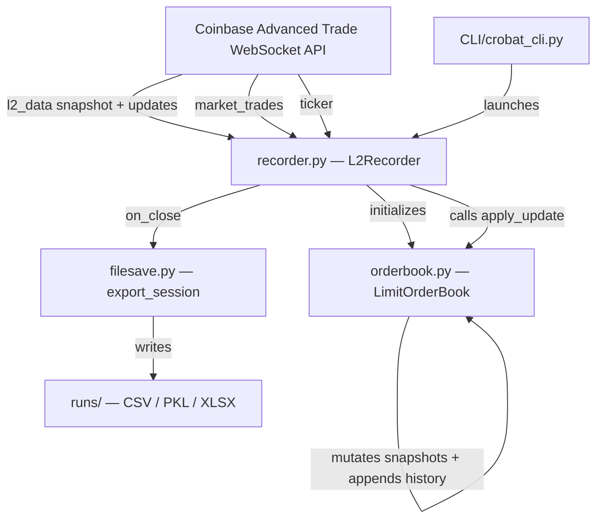
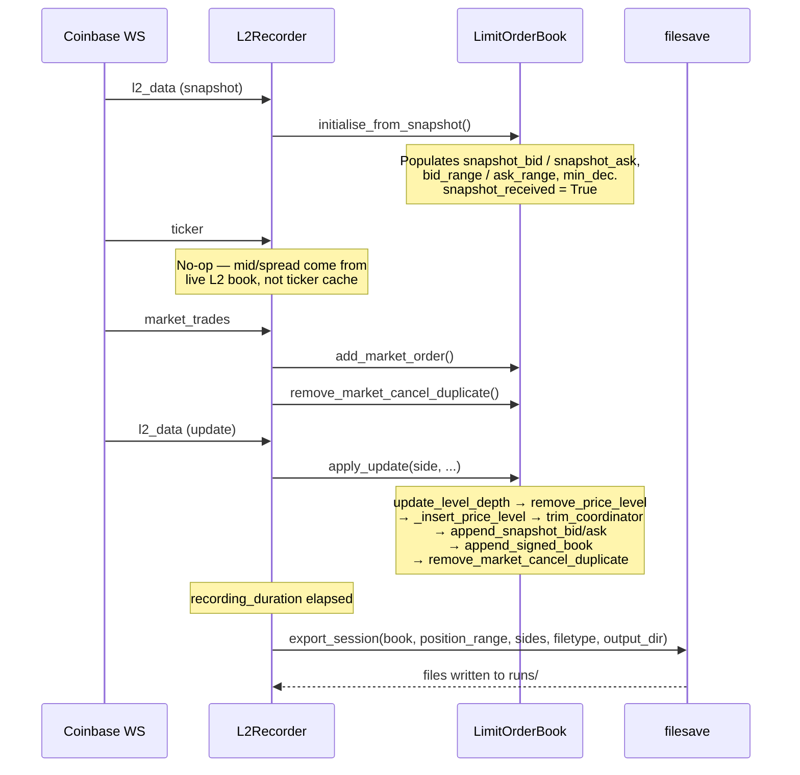
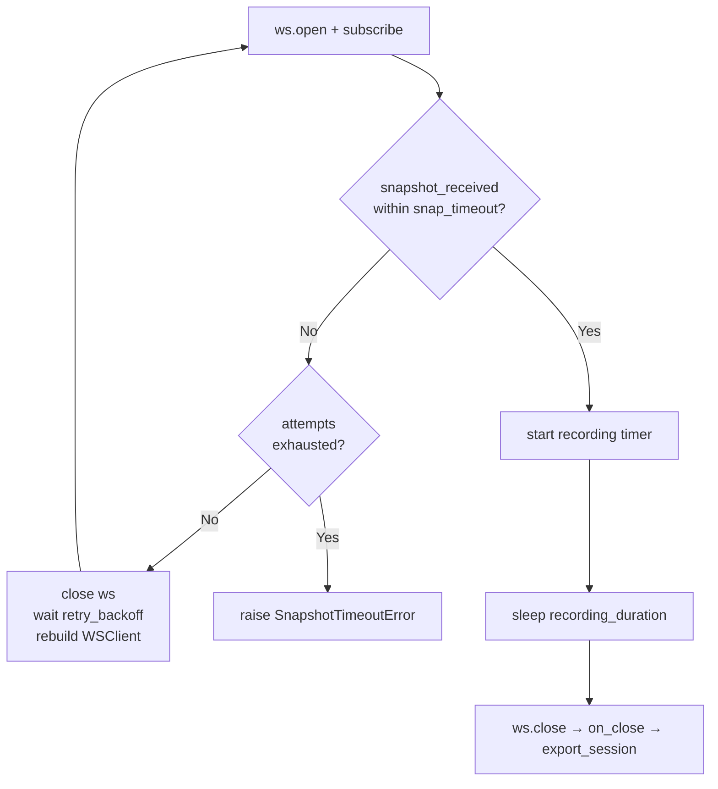
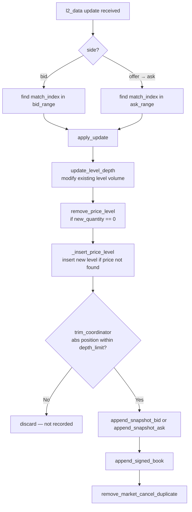
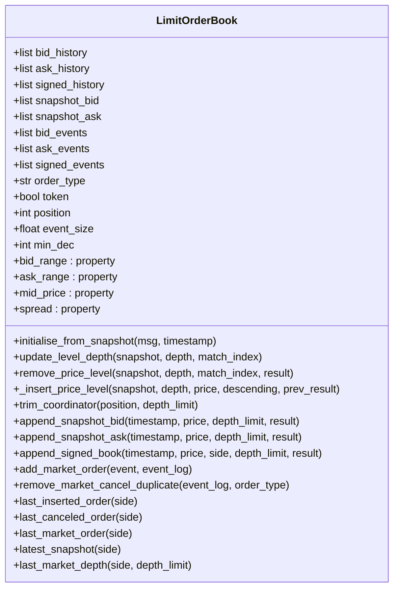
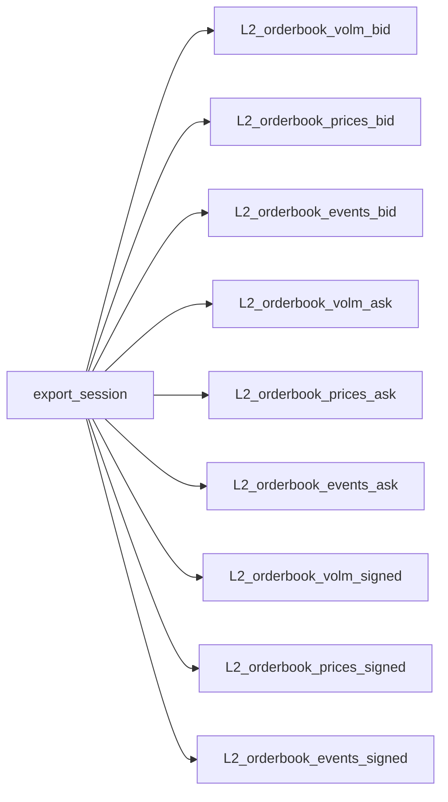

# crobat — Architecture & Developer Guide

**crobat** is a Python library that connects to the Coinbase Advanced Trade
WebSocket feed, reconstructs a live Level 2 order book, records limit order
insertions, cancellations, and market orders, and exports the results to
CSV, PKL, or XLSX files.

---

## High-Level System Overview



---

## Module Breakdown

### `crobat/` — Core Library

| File | Responsibility |
|---|---|
| `recorder.py` | `L2Recorder` — WebSocket client. Subscribes to `level2`, `market_trades`, and `ticker` channels. Routes messages to handlers, drives the order book update loop, triggers file export on close. Also defines `SnapshotTimeoutError`. |
| `orderbook.py` | `LimitOrderBook` class — all live order book state and history. Also contains the module-level `apply_update` orchestration function and `price_match`. Backward-compatible aliases `apply_bid_update` / `apply_ask_update` are kept for external callers. |
| `orderbook_helpers.py` | Pure utility functions: `compute_sign`, `compute_signed_position`, `compute_min_decimals`. No state, no side effects. |
| `filesave.py` | Converts `LimitOrderBook` history arrays to DataFrames and writes output files. Called automatically by `L2Recorder.on_close` via `export_session`. |
| `config.py` | Loads Coinbase credentials from `cdp_api_key.json` and recording defaults from `config.ini`. |

### `CLI/` — Command Line Interface

`crobat_cli.py` uses `argparse` to accept recording parameters as flags or
prompt for them interactively, then launches a session. No external
dependencies beyond the crobat package itself.

---

## Message Processing Flow



---

## Snapshot Timeout and Retry Logic

`L2Recorder.start()` polls `snapshot_received` after subscribing. If the
snapshot is not received within `snap_timeout` seconds, the connection is
closed and reopened after `retry_backoff` seconds. At most `1 + max_retries`
total connections are opened.



---

## Order Book Update Sequence

Each L2 update runs through a fixed four-step mutation sequence with
explicit data flow — each step receives the `_UpdateResult` from the
previous one rather than reading back from shared state.



---

## `LimitOrderBook` State



---

## Output Files

Each session produces up to 9 files in `runs/` depending on `sides` and
`filetype` settings:



**Event record columns (single side):**

| time | order_type | price | size | position | mid_price | spread |
|---|---|---|---|---|---|---|
| datetime | insertion / cancellation / market | float | float | int | float | float |

**Signed events** add a `side` column and use signed `size` and `position`
(negative = bid side), following the convention from
Cont, Kukanov and Stoikov (2011).

| time | order_type | price | size | position | side | mid_price | spread |
|---|---|---|---|---|---|---|---|
| datetime | insertion / cancellation / market | float | ± float | ± int | bid/ask | float | float |

All numeric values are written with 8 decimal places. No scientific notation,
no IEEE 754 float artifacts.

---

## Configuration

| Parameter | Source | Default |
|---|---|---|
| `currency_pair` | `config.ini` | `XRP-USD` |
| `recording_duration` | `config.ini` | `10` |
| `position_range` | `config.ini` | `5` |
| `sides` | `config.ini` | `bid,ask,signed` |
| `filetype` | `config.ini` | `csv` |
| `output_dir` | CLI flag | `runs` |

Credentials are loaded from `cdp_api_key.json` (downloaded from the Coinbase
Developer Portal). If the file is absent, `WSClient` falls back to the
`COINBASE_API_KEY` / `COINBASE_API_SECRET` environment variables.

---

## Documentation Management

Sphinx docs live in `docs/`. The compiled PDF is committed at
`docs/manual/manual.pdf` and should be rebuilt whenever the RST files change.

### Commands

All commands run from the `docs/` directory.

| Command | Effect |
|---|---|
| `make html` | Build HTML docs |
| `make latexpdf` | Build PDF from RST source |
| `make clean` | Delete the `_build/` cache entirely |

### Always `make clean` before rebuilding

Sphinx caches build artifacts in `docs/_build/`. If you change RST files and
run `make latexpdf` without cleaning first, Sphinx may report
`Nothing to do` and produce a stale PDF. Always clean before a rebuild:

```bash
cd docs
make clean && make latexpdf
cp _build/latex/crobat.pdf manual/manual.pdf
```

### When to rebuild

- Any change to `docs/*.rst`
- Any change to docstrings in `crobat/*.py` (autodoc pulls these at build time)
- After adding or removing modules from `docs/api.rst`

### `docs/_build/` is gitignored

Build output is excluded from git. Only `docs/manual/manual.pdf` is committed.
